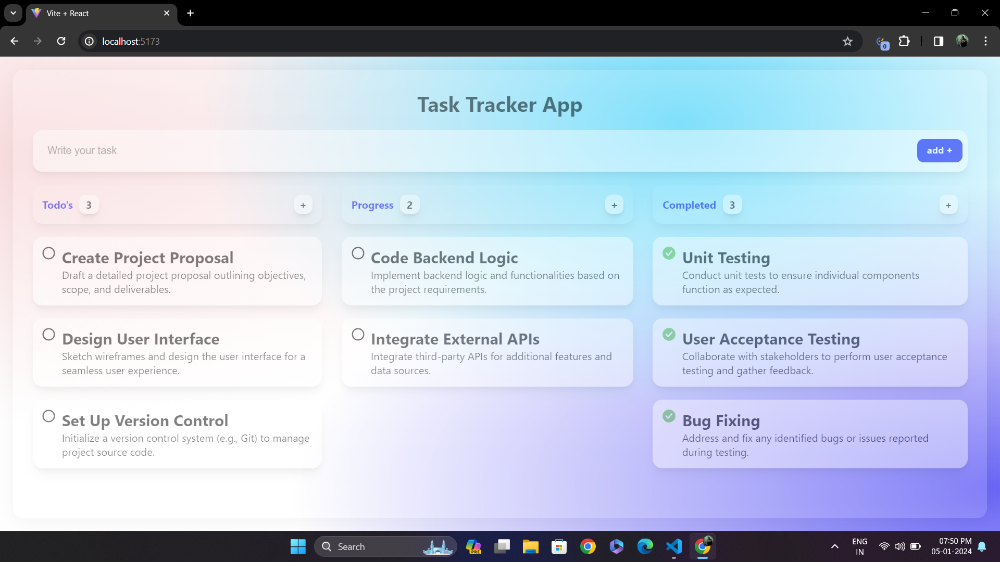

# Task Tracker Application

This project is a simple Task Tracker application built using React. It utilizes the `useState` hook to manage the state of tasks in different categories - Todo's, In Progress, and Completed.




## Getting Started

To get started with the Task Tracker Application, follow these steps:

1. Clone the repository:

   ```bash
   git clone https://github.com/Ashok-Kumar-dharanikota/REACT-Mastery.git
    ```

    Change into the project directory:

    ```bash
    cd task-tracker-app
    ```

    Install dependencies:
    ```bash
    npm install
    ```
    Run the application:
    ```bash
    npm run dev
    ```

    This will start the development server, and you can view the app in your browser at http://localhost:5173

## Functionality

The Task Tracker Application allows you to manage tasks in three different states:

 * **Todo's**: Tasks that are yet to be started.
 * **Progress**: Tasks that are currently in progress.
 * **Completed**: Tasks that have been successfully completed.

Each task has a title and a description associated with it. You can easily add, move, and remove tasks between the different categories.

## Features
* **Add Task**: Click the "Add Task" button to create a new task. Provide a title and description for the task.
<!-- Move Task: Drag and drop tasks between different categories to change their status.
Delete Task: Click the delete icon on a task to remove it from the list. -->
* **Responsive Design**: The application is designed to be responsive, ensuring a seamless experience across various devices.

## Technologies Used
* React
* useState hook for state management

## Project Structure
The project structure is organized as follows:

* **src**/
* * **components**/: React components used in the application.
* * **App.js**: Main application component.
* * **App.css**: Styling for the application.

## Contributing
If you'd like to contribute to the project, please follow the standard GitHub workflow:

* Fork the repository.
* Create a new branch for your feature or bug fix: git checkout -b feature-name.
* Make your changes and commit them: git commit -m 'Add new feature'.
* Push the changes to your fork: git push origin feature-name.
* Create a Pull Request.
